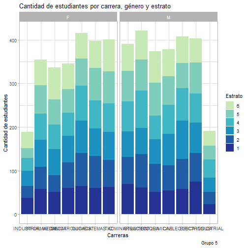
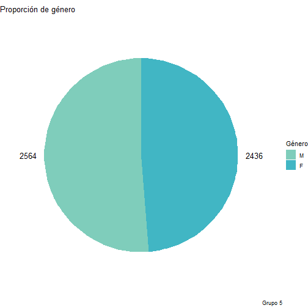
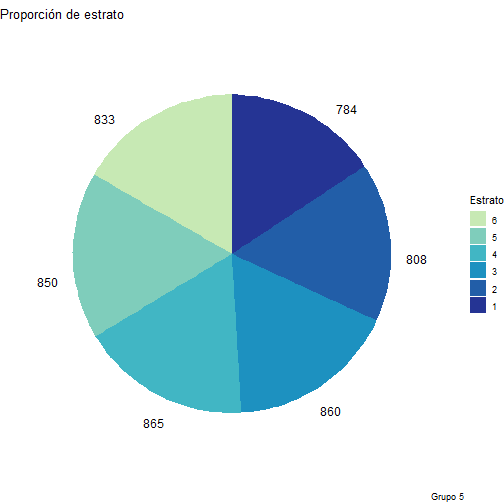
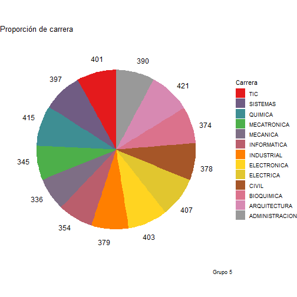
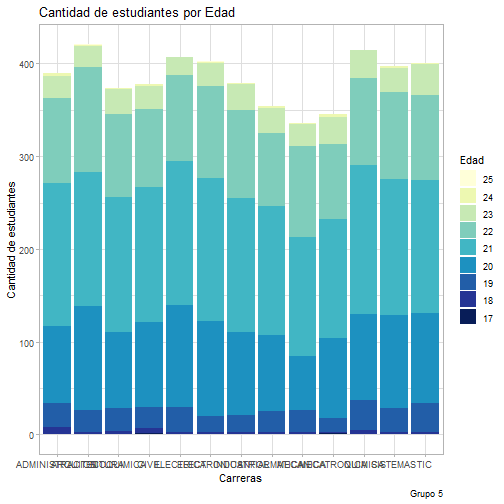
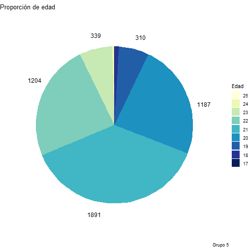
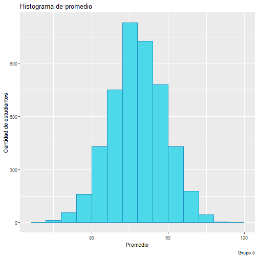
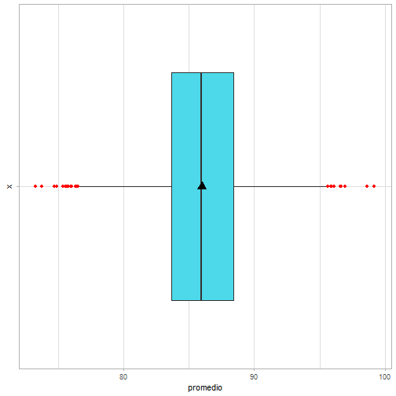
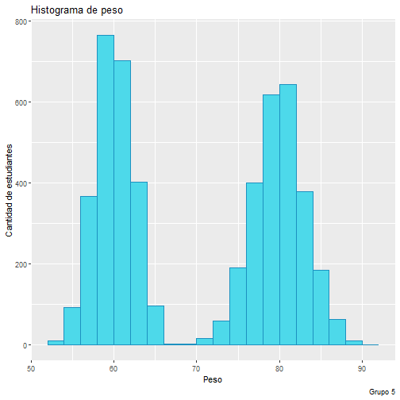
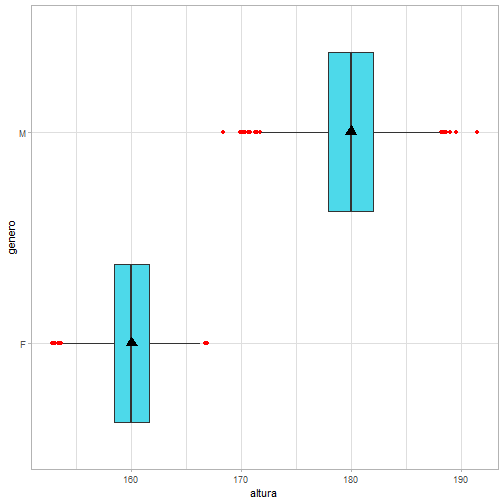

---
output:
  pdf_document: default
  html_document: default
---


```r
# Librerias
library(ggplot2) #Graficas
library(dplyr) #Ordenar datos
library(reshape2) #Ordenar datos
library(tidyverse) #Mas datos
library(RColorBrewer) #Colores personalizados
library(modeest) #Datos
library(EnvStats) #CV
library(scales) #Tortas

# R Commander
library(Rcmdr)


# Importar datos
EAlumnos <- 
  readXL("G:/Mi unidad/III Semestre/Probabilidad y Estadística Fundamental/Parcial/Alumnos.xlsx",
         rownames=FALSE, header=TRUE, na="", sheet="alumnos%20simulados", 
         stringsAsFactors=TRUE)
alumnos <- data.frame(EAlumnos)


# Punto 2: Gráficas género, carrera y estrato
## Barras
p2_alumnos <- alumnos %>% count(carrera,genero,Estrato) %>% group_by(carrera,genero,Estrato) # SE ME

p2_colores = brewer.pal(n = 9, "YlGnBu")[3:9]

ggplot(p2_alumnos, aes(x=carrera, y=n, fill=forcats::fct_rev(factor(Estrato)))) +
  facet_wrap(~ genero, scales = "free_x") +
  scale_fill_manual(values=p2_colores) +
  geom_col(position = position_stack()) +
  xlab("Carreras") + ylab("Cantidad de estudiantes") + 
  labs(title="Cantidad de estudiantes por carrera, género y estrato", fill="Estrato", caption="Grupo 5") +
  theme_light()
```



```r
## Torta
### Género
p2_colores_2 = brewer.pal(n = 9, "YlGnBu")[4:9]

p2_g <- alumnos %>% 
  group_by(genero) %>%
  summarise(n = n()) %>%
  mutate(prop = n / sum(n) *100) %>%
  mutate(ypos = 37*cumsum(prop)- 5*prop )

ggplot(p2_g, aes(x="", y=n, fill=forcats::fct_rev(factor(genero)))) +
  geom_col(position = position_stack()) +
  scale_fill_manual(values=p2_colores_2) +
  xlab("") + ylab("") +
  labs(title="Proporción de género", fill="Género", caption="Grupo 5") +
  coord_polar("y", start=0) +
  geom_text(aes(x=1.6,y = c(1250,3750), label = n), color = "black", size=4.5) +
  theme_void()
```



```r
### Estrato
p2_e <- alumnos %>% 
  group_by(Estrato) %>%
  summarise(n = n()) %>%
  mutate(prop = n / sum(n) *100) %>%
  mutate(ypos = 46*cumsum(prop)- 12*prop )

ggplot(p2_e, aes(x="", y=n, fill=forcats::fct_rev(factor(Estrato)))) +
  geom_col(position = position_stack()) +
  scale_fill_manual(values=p2_colores) +
  xlab("") + ylab("") +
  labs(title="Proporción de estrato", fill="Estrato", caption="Grupo 5") +
  coord_polar("y", start=0) +
  geom_text(aes(x=1.6,y = ypos, label = n), color = "black", size=4.2) +
  theme_void()
```



```r
### Carrera
colourCount = length(unique(alumnos$carrera))
p2_colores_3 = colorRampPalette(brewer.pal(9, "Set1"))

p2_c <- alumnos %>% 
  group_by(carrera) %>%
  summarise(n = n()) %>%
  mutate(prop = n / sum(n) *100) %>%
  mutate(ypos = 50*cumsum(prop)- 20*prop )

ggplot(p2_c, aes(x="", y=n, fill=forcats::fct_rev(factor(carrera)))) +
  geom_col(position = position_stack()) +
  scale_fill_manual(values=p2_colores_3(colourCount)) +
  xlab("") + ylab("") +
  labs(title="Proporción de carrera", fill="Carrera", caption="Grupo 5") +
  coord_polar("y", start=0) +
  geom_text(aes(x=1.6,y = ypos, label = n), color = "black", size=4.2) +
  theme_void()
```



```r
# Punto 3: Carrera y género
p3_al <- alumnos %>% count(carrera,genero) %>% group_by(carrera,genero)
p3_ta = cbind(p3_al)
p3_ta
```

```
## # A tibble: 14 x 3
## # Groups:   carrera, genero [14]
##    carrera        genero     n
##    <fct>          <fct>  <int>
##  1 ADMINISTRACION M        390
##  2 ARQUITECTURA   M        421
##  3 BIOQUIMICA     M        374
##  4 CIVIL          M        378
##  5 ELECTRICA      M        407
##  6 ELECTRONICA    M        403
##  7 INDUSTRIAL     F        188
##  8 INDUSTRIAL     M        191
##  9 INFORMATICA    F        354
## 10 MECANICA       F        336
## 11 MECATRONICA    F        345
## 12 QUIMICA        F        415
## 13 SISTEMAS       F        397
## 14 TIC            F        401
```

```r
# Punto 4: Freq rel carrera y estrato
p4_al <- alumnos %>% group_by(carrera, Estrato) %>% summarise(n = n()) %>%  mutate(freq=n/sum(n)) %>%
  select(carrera,Estrato,freq) %>% pivot_wider(names_from = Estrato, values_from = freq)
```

```
## `summarise()` has grouped output by 'carrera'. You can override using the `.groups` argument.
```

```r
p4_ta = cbind(p4_al)
p4_ta
```

```
## # A tibble: 13 x 7
## # Groups:   carrera [13]
##    carrera          `1`   `2`   `3`   `4`   `5`   `6`
##    <fct>          <dbl> <dbl> <dbl> <dbl> <dbl> <dbl>
##  1 ADMINISTRACION 0.177 0.159 0.151 0.177 0.177 0.159
##  2 ARQUITECTURA   0.145 0.183 0.143 0.202 0.169 0.159
##  3 BIOQUIMICA     0.136 0.171 0.152 0.144 0.201 0.195
##  4 CIVIL          0.143 0.153 0.190 0.177 0.172 0.164
##  5 ELECTRICA      0.143 0.170 0.216 0.182 0.143 0.147
##  6 ELECTRONICA    0.186 0.161 0.174 0.166 0.176 0.136
##  7 INDUSTRIAL     0.158 0.148 0.177 0.187 0.142 0.187
##  8 INFORMATICA    0.164 0.141 0.178 0.167 0.186 0.164
##  9 MECANICA       0.152 0.113 0.179 0.167 0.173 0.217
## 10 MECATRONICA    0.174 0.171 0.174 0.157 0.157 0.168
## 11 QUIMICA        0.157 0.181 0.181 0.193 0.149 0.140
## 12 SISTEMAS       0.151 0.184 0.161 0.161 0.186 0.156
## 13 TIC            0.155 0.155 0.162 0.162 0.182 0.185
```

```r
# Punto 5: Gráficos edad
## Barras
p5_alumnos <- alumnos %>% group_by(carrera,edad) %>% count(carrera)

p5_colores = brewer.pal(n = 9, "YlGnBu")[1:9]

ggplot(p5_alumnos, aes(x=carrera, y=n, fill=forcats::fct_rev(factor(edad)))) +
  scale_fill_manual(values=p5_colores) +
  geom_col(position = position_stack()) +
  xlab("Carreras") + ylab("Cantidad de estudiantes") + 
  labs(title="Cantidad de estudiantes por Edad", fill="Edad", caption="Grupo 5") +
  theme_light()
```



```r
## Torta
p5_e <- alumnos %>% 
  group_by(edad) %>%
  summarise(n = n()) %>%
  mutate(prop = n / sum(n) *100) %>%
  mutate(ypos = 50*cumsum(prop)- 20*prop )

ggplot(p5_e, aes(x="", y=n, fill=forcats::fct_rev(factor(edad)))) +
  geom_col(position = position_stack()) +
  scale_fill_manual(values=p5_colores) +
  xlab("") + ylab("") +
  labs(title="Proporción de edad", fill="Edad", caption="Grupo 5") +
  coord_polar("y", start=0) +
  geom_text(aes(x=1.6, y = ypos, label = c("","",310,1187,1891,1204,339,"","")), color = "black", size=4.2) +
  theme_void()
```



```r
# Punto 6: Gráficas var. continuas
## Promedio
### Histograma
p6_alumnos <- alumnos %>% select(promedio,peso,altura,genero)

p6_breaks_p <- pretty(range(p6_alumnos$promedio), n=nclass.Sturges((p6_alumnos$promedio)), min.n=1)

ggplot(p6_alumnos, aes(x=promedio)) +
  geom_histogram(breaks=p6_breaks_p, fill="#4DD9EA", color="#1D91C0") +
  xlab("Promedio") + ylab("Cantidad de estudiantes") +
  labs(title="Histograma de promedio", caption="Grupo 5")
```



```r
  theme_light()
```

```
## List of 93
##  $ line                      :List of 6
##   ..$ colour       : chr "black"
##   ..$ size         : num 0.5
##   ..$ linetype     : num 1
##   ..$ lineend      : chr "butt"
##   ..$ arrow        : logi FALSE
##   ..$ inherit.blank: logi TRUE
##   ..- attr(*, "class")= chr [1:2] "element_line" "element"
##  $ rect                      :List of 5
##   ..$ fill         : chr "white"
##   ..$ colour       : chr "black"
##   ..$ size         : num 0.5
##   ..$ linetype     : num 1
##   ..$ inherit.blank: logi TRUE
##   ..- attr(*, "class")= chr [1:2] "element_rect" "element"
##  $ text                      :List of 11
##   ..$ family       : chr ""
##   ..$ face         : chr "plain"
##   ..$ colour       : chr "black"
##   ..$ size         : num 11
##   ..$ hjust        : num 0.5
##   ..$ vjust        : num 0.5
##   ..$ angle        : num 0
##   ..$ lineheight   : num 0.9
##   ..$ margin       : 'margin' num [1:4] 0points 0points 0points 0points
##   .. ..- attr(*, "unit")= int 8
##   ..$ debug        : logi FALSE
##   ..$ inherit.blank: logi TRUE
##   ..- attr(*, "class")= chr [1:2] "element_text" "element"
##  $ title                     : NULL
##  $ aspect.ratio              : NULL
##  $ axis.title                : NULL
##  $ axis.title.x              :List of 11
##   ..$ family       : NULL
##   ..$ face         : NULL
##   ..$ colour       : NULL
##   ..$ size         : NULL
##   ..$ hjust        : NULL
##   ..$ vjust        : num 1
##   ..$ angle        : NULL
##   ..$ lineheight   : NULL
##   ..$ margin       : 'margin' num [1:4] 2.75points 0points 0points 0points
##   .. ..- attr(*, "unit")= int 8
##   ..$ debug        : NULL
##   ..$ inherit.blank: logi TRUE
##   ..- attr(*, "class")= chr [1:2] "element_text" "element"
##  $ axis.title.x.top          :List of 11
##   ..$ family       : NULL
##   ..$ face         : NULL
##   ..$ colour       : NULL
##   ..$ size         : NULL
##   ..$ hjust        : NULL
##   ..$ vjust        : num 0
##   ..$ angle        : NULL
##   ..$ lineheight   : NULL
##   ..$ margin       : 'margin' num [1:4] 0points 0points 2.75points 0points
##   .. ..- attr(*, "unit")= int 8
##   ..$ debug        : NULL
##   ..$ inherit.blank: logi TRUE
##   ..- attr(*, "class")= chr [1:2] "element_text" "element"
##  $ axis.title.x.bottom       : NULL
##  $ axis.title.y              :List of 11
##   ..$ family       : NULL
##   ..$ face         : NULL
##   ..$ colour       : NULL
##   ..$ size         : NULL
##   ..$ hjust        : NULL
##   ..$ vjust        : num 1
##   ..$ angle        : num 90
##   ..$ lineheight   : NULL
##   ..$ margin       : 'margin' num [1:4] 0points 2.75points 0points 0points
##   .. ..- attr(*, "unit")= int 8
##   ..$ debug        : NULL
##   ..$ inherit.blank: logi TRUE
##   ..- attr(*, "class")= chr [1:2] "element_text" "element"
##  $ axis.title.y.left         : NULL
##  $ axis.title.y.right        :List of 11
##   ..$ family       : NULL
##   ..$ face         : NULL
##   ..$ colour       : NULL
##   ..$ size         : NULL
##   ..$ hjust        : NULL
##   ..$ vjust        : num 0
##   ..$ angle        : num -90
##   ..$ lineheight   : NULL
##   ..$ margin       : 'margin' num [1:4] 0points 0points 0points 2.75points
##   .. ..- attr(*, "unit")= int 8
##   ..$ debug        : NULL
##   ..$ inherit.blank: logi TRUE
##   ..- attr(*, "class")= chr [1:2] "element_text" "element"
##  $ axis.text                 :List of 11
##   ..$ family       : NULL
##   ..$ face         : NULL
##   ..$ colour       : chr "grey30"
##   ..$ size         : 'rel' num 0.8
##   ..$ hjust        : NULL
##   ..$ vjust        : NULL
##   ..$ angle        : NULL
##   ..$ lineheight   : NULL
##   ..$ margin       : NULL
##   ..$ debug        : NULL
##   ..$ inherit.blank: logi TRUE
##   ..- attr(*, "class")= chr [1:2] "element_text" "element"
##  $ axis.text.x               :List of 11
##   ..$ family       : NULL
##   ..$ face         : NULL
##   ..$ colour       : NULL
##   ..$ size         : NULL
##   ..$ hjust        : NULL
##   ..$ vjust        : num 1
##   ..$ angle        : NULL
##   ..$ lineheight   : NULL
##   ..$ margin       : 'margin' num [1:4] 2.2points 0points 0points 0points
##   .. ..- attr(*, "unit")= int 8
##   ..$ debug        : NULL
##   ..$ inherit.blank: logi TRUE
##   ..- attr(*, "class")= chr [1:2] "element_text" "element"
##  $ axis.text.x.top           :List of 11
##   ..$ family       : NULL
##   ..$ face         : NULL
##   ..$ colour       : NULL
##   ..$ size         : NULL
##   ..$ hjust        : NULL
##   ..$ vjust        : num 0
##   ..$ angle        : NULL
##   ..$ lineheight   : NULL
##   ..$ margin       : 'margin' num [1:4] 0points 0points 2.2points 0points
##   .. ..- attr(*, "unit")= int 8
##   ..$ debug        : NULL
##   ..$ inherit.blank: logi TRUE
##   ..- attr(*, "class")= chr [1:2] "element_text" "element"
##  $ axis.text.x.bottom        : NULL
##  $ axis.text.y               :List of 11
##   ..$ family       : NULL
##   ..$ face         : NULL
##   ..$ colour       : NULL
##   ..$ size         : NULL
##   ..$ hjust        : num 1
##   ..$ vjust        : NULL
##   ..$ angle        : NULL
##   ..$ lineheight   : NULL
##   ..$ margin       : 'margin' num [1:4] 0points 2.2points 0points 0points
##   .. ..- attr(*, "unit")= int 8
##   ..$ debug        : NULL
##   ..$ inherit.blank: logi TRUE
##   ..- attr(*, "class")= chr [1:2] "element_text" "element"
##  $ axis.text.y.left          : NULL
##  $ axis.text.y.right         :List of 11
##   ..$ family       : NULL
##   ..$ face         : NULL
##   ..$ colour       : NULL
##   ..$ size         : NULL
##   ..$ hjust        : num 0
##   ..$ vjust        : NULL
##   ..$ angle        : NULL
##   ..$ lineheight   : NULL
##   ..$ margin       : 'margin' num [1:4] 0points 0points 0points 2.2points
##   .. ..- attr(*, "unit")= int 8
##   ..$ debug        : NULL
##   ..$ inherit.blank: logi TRUE
##   ..- attr(*, "class")= chr [1:2] "element_text" "element"
##  $ axis.ticks                :List of 6
##   ..$ colour       : chr "grey70"
##   ..$ size         : 'rel' num 0.5
##   ..$ linetype     : NULL
##   ..$ lineend      : NULL
##   ..$ arrow        : logi FALSE
##   ..$ inherit.blank: logi TRUE
##   ..- attr(*, "class")= chr [1:2] "element_line" "element"
##  $ axis.ticks.x              : NULL
##  $ axis.ticks.x.top          : NULL
##  $ axis.ticks.x.bottom       : NULL
##  $ axis.ticks.y              : NULL
##  $ axis.ticks.y.left         : NULL
##  $ axis.ticks.y.right        : NULL
##  $ axis.ticks.length         : 'simpleUnit' num 2.75points
##   ..- attr(*, "unit")= int 8
##  $ axis.ticks.length.x       : NULL
##  $ axis.ticks.length.x.top   : NULL
##  $ axis.ticks.length.x.bottom: NULL
##  $ axis.ticks.length.y       : NULL
##  $ axis.ticks.length.y.left  : NULL
##  $ axis.ticks.length.y.right : NULL
##  $ axis.line                 : list()
##   ..- attr(*, "class")= chr [1:2] "element_blank" "element"
##  $ axis.line.x               : NULL
##  $ axis.line.x.top           : NULL
##  $ axis.line.x.bottom        : NULL
##  $ axis.line.y               : NULL
##  $ axis.line.y.left          : NULL
##  $ axis.line.y.right         : NULL
##  $ legend.background         :List of 5
##   ..$ fill         : NULL
##   ..$ colour       : logi NA
##   ..$ size         : NULL
##   ..$ linetype     : NULL
##   ..$ inherit.blank: logi TRUE
##   ..- attr(*, "class")= chr [1:2] "element_rect" "element"
##  $ legend.margin             : 'margin' num [1:4] 5.5points 5.5points 5.5points 5.5points
##   ..- attr(*, "unit")= int 8
##  $ legend.spacing            : 'simpleUnit' num 11points
##   ..- attr(*, "unit")= int 8
##  $ legend.spacing.x          : NULL
##  $ legend.spacing.y          : NULL
##  $ legend.key                :List of 5
##   ..$ fill         : chr "white"
##   ..$ colour       : logi NA
##   ..$ size         : NULL
##   ..$ linetype     : NULL
##   ..$ inherit.blank: logi TRUE
##   ..- attr(*, "class")= chr [1:2] "element_rect" "element"
##  $ legend.key.size           : 'simpleUnit' num 1.2lines
##   ..- attr(*, "unit")= int 3
##  $ legend.key.height         : NULL
##  $ legend.key.width          : NULL
##  $ legend.text               :List of 11
##   ..$ family       : NULL
##   ..$ face         : NULL
##   ..$ colour       : NULL
##   ..$ size         : 'rel' num 0.8
##   ..$ hjust        : NULL
##   ..$ vjust        : NULL
##   ..$ angle        : NULL
##   ..$ lineheight   : NULL
##   ..$ margin       : NULL
##   ..$ debug        : NULL
##   ..$ inherit.blank: logi TRUE
##   ..- attr(*, "class")= chr [1:2] "element_text" "element"
##  $ legend.text.align         : NULL
##  $ legend.title              :List of 11
##   ..$ family       : NULL
##   ..$ face         : NULL
##   ..$ colour       : NULL
##   ..$ size         : NULL
##   ..$ hjust        : num 0
##   ..$ vjust        : NULL
##   ..$ angle        : NULL
##   ..$ lineheight   : NULL
##   ..$ margin       : NULL
##   ..$ debug        : NULL
##   ..$ inherit.blank: logi TRUE
##   ..- attr(*, "class")= chr [1:2] "element_text" "element"
##  $ legend.title.align        : NULL
##  $ legend.position           : chr "right"
##  $ legend.direction          : NULL
##  $ legend.justification      : chr "center"
##  $ legend.box                : NULL
##  $ legend.box.just           : NULL
##  $ legend.box.margin         : 'margin' num [1:4] 0cm 0cm 0cm 0cm
##   ..- attr(*, "unit")= int 1
##  $ legend.box.background     : list()
##   ..- attr(*, "class")= chr [1:2] "element_blank" "element"
##  $ legend.box.spacing        : 'simpleUnit' num 11points
##   ..- attr(*, "unit")= int 8
##  $ panel.background          :List of 5
##   ..$ fill         : chr "white"
##   ..$ colour       : logi NA
##   ..$ size         : NULL
##   ..$ linetype     : NULL
##   ..$ inherit.blank: logi TRUE
##   ..- attr(*, "class")= chr [1:2] "element_rect" "element"
##  $ panel.border              :List of 5
##   ..$ fill         : logi NA
##   ..$ colour       : chr "grey70"
##   ..$ size         : 'rel' num 1
##   ..$ linetype     : NULL
##   ..$ inherit.blank: logi TRUE
##   ..- attr(*, "class")= chr [1:2] "element_rect" "element"
##  $ panel.spacing             : 'simpleUnit' num 5.5points
##   ..- attr(*, "unit")= int 8
##  $ panel.spacing.x           : NULL
##  $ panel.spacing.y           : NULL
##  $ panel.grid                :List of 6
##   ..$ colour       : chr "grey87"
##   ..$ size         : NULL
##   ..$ linetype     : NULL
##   ..$ lineend      : NULL
##   ..$ arrow        : logi FALSE
##   ..$ inherit.blank: logi TRUE
##   ..- attr(*, "class")= chr [1:2] "element_line" "element"
##  $ panel.grid.major          :List of 6
##   ..$ colour       : NULL
##   ..$ size         : 'rel' num 0.5
##   ..$ linetype     : NULL
##   ..$ lineend      : NULL
##   ..$ arrow        : logi FALSE
##   ..$ inherit.blank: logi TRUE
##   ..- attr(*, "class")= chr [1:2] "element_line" "element"
##  $ panel.grid.minor          :List of 6
##   ..$ colour       : NULL
##   ..$ size         : 'rel' num 0.25
##   ..$ linetype     : NULL
##   ..$ lineend      : NULL
##   ..$ arrow        : logi FALSE
##   ..$ inherit.blank: logi TRUE
##   ..- attr(*, "class")= chr [1:2] "element_line" "element"
##  $ panel.grid.major.x        : NULL
##  $ panel.grid.major.y        : NULL
##  $ panel.grid.minor.x        : NULL
##  $ panel.grid.minor.y        : NULL
##  $ panel.ontop               : logi FALSE
##  $ plot.background           :List of 5
##   ..$ fill         : NULL
##   ..$ colour       : chr "white"
##   ..$ size         : NULL
##   ..$ linetype     : NULL
##   ..$ inherit.blank: logi TRUE
##   ..- attr(*, "class")= chr [1:2] "element_rect" "element"
##  $ plot.title                :List of 11
##   ..$ family       : NULL
##   ..$ face         : NULL
##   ..$ colour       : NULL
##   ..$ size         : 'rel' num 1.2
##   ..$ hjust        : num 0
##   ..$ vjust        : num 1
##   ..$ angle        : NULL
##   ..$ lineheight   : NULL
##   ..$ margin       : 'margin' num [1:4] 0points 0points 5.5points 0points
##   .. ..- attr(*, "unit")= int 8
##   ..$ debug        : NULL
##   ..$ inherit.blank: logi TRUE
##   ..- attr(*, "class")= chr [1:2] "element_text" "element"
##  $ plot.title.position       : chr "panel"
##  $ plot.subtitle             :List of 11
##   ..$ family       : NULL
##   ..$ face         : NULL
##   ..$ colour       : NULL
##   ..$ size         : NULL
##   ..$ hjust        : num 0
##   ..$ vjust        : num 1
##   ..$ angle        : NULL
##   ..$ lineheight   : NULL
##   ..$ margin       : 'margin' num [1:4] 0points 0points 5.5points 0points
##   .. ..- attr(*, "unit")= int 8
##   ..$ debug        : NULL
##   ..$ inherit.blank: logi TRUE
##   ..- attr(*, "class")= chr [1:2] "element_text" "element"
##  $ plot.caption              :List of 11
##   ..$ family       : NULL
##   ..$ face         : NULL
##   ..$ colour       : NULL
##   ..$ size         : 'rel' num 0.8
##   ..$ hjust        : num 1
##   ..$ vjust        : num 1
##   ..$ angle        : NULL
##   ..$ lineheight   : NULL
##   ..$ margin       : 'margin' num [1:4] 5.5points 0points 0points 0points
##   .. ..- attr(*, "unit")= int 8
##   ..$ debug        : NULL
##   ..$ inherit.blank: logi TRUE
##   ..- attr(*, "class")= chr [1:2] "element_text" "element"
##  $ plot.caption.position     : chr "panel"
##  $ plot.tag                  :List of 11
##   ..$ family       : NULL
##   ..$ face         : NULL
##   ..$ colour       : NULL
##   ..$ size         : 'rel' num 1.2
##   ..$ hjust        : num 0.5
##   ..$ vjust        : num 0.5
##   ..$ angle        : NULL
##   ..$ lineheight   : NULL
##   ..$ margin       : NULL
##   ..$ debug        : NULL
##   ..$ inherit.blank: logi TRUE
##   ..- attr(*, "class")= chr [1:2] "element_text" "element"
##  $ plot.tag.position         : chr "topleft"
##  $ plot.margin               : 'margin' num [1:4] 5.5points 5.5points 5.5points 5.5points
##   ..- attr(*, "unit")= int 8
##  $ strip.background          :List of 5
##   ..$ fill         : chr "grey70"
##   ..$ colour       : logi NA
##   ..$ size         : NULL
##   ..$ linetype     : NULL
##   ..$ inherit.blank: logi TRUE
##   ..- attr(*, "class")= chr [1:2] "element_rect" "element"
##  $ strip.background.x        : NULL
##  $ strip.background.y        : NULL
##  $ strip.placement           : chr "inside"
##  $ strip.text                :List of 11
##   ..$ family       : NULL
##   ..$ face         : NULL
##   ..$ colour       : chr "white"
##   ..$ size         : 'rel' num 0.8
##   ..$ hjust        : NULL
##   ..$ vjust        : NULL
##   ..$ angle        : NULL
##   ..$ lineheight   : NULL
##   ..$ margin       : 'margin' num [1:4] 4.4points 4.4points 4.4points 4.4points
##   .. ..- attr(*, "unit")= int 8
##   ..$ debug        : NULL
##   ..$ inherit.blank: logi TRUE
##   ..- attr(*, "class")= chr [1:2] "element_text" "element"
##  $ strip.text.x              : NULL
##  $ strip.text.y              :List of 11
##   ..$ family       : NULL
##   ..$ face         : NULL
##   ..$ colour       : NULL
##   ..$ size         : NULL
##   ..$ hjust        : NULL
##   ..$ vjust        : NULL
##   ..$ angle        : num -90
##   ..$ lineheight   : NULL
##   ..$ margin       : NULL
##   ..$ debug        : NULL
##   ..$ inherit.blank: logi TRUE
##   ..- attr(*, "class")= chr [1:2] "element_text" "element"
##  $ strip.switch.pad.grid     : 'simpleUnit' num 2.75points
##   ..- attr(*, "unit")= int 8
##  $ strip.switch.pad.wrap     : 'simpleUnit' num 2.75points
##   ..- attr(*, "unit")= int 8
##  $ strip.text.y.left         :List of 11
##   ..$ family       : NULL
##   ..$ face         : NULL
##   ..$ colour       : NULL
##   ..$ size         : NULL
##   ..$ hjust        : NULL
##   ..$ vjust        : NULL
##   ..$ angle        : num 90
##   ..$ lineheight   : NULL
##   ..$ margin       : NULL
##   ..$ debug        : NULL
##   ..$ inherit.blank: logi TRUE
##   ..- attr(*, "class")= chr [1:2] "element_text" "element"
##  - attr(*, "class")= chr [1:2] "theme" "gg"
##  - attr(*, "complete")= logi TRUE
##  - attr(*, "validate")= logi TRUE
```

```r
### Caja
ggplot(p6_alumnos, aes(x="", y=promedio)) +
  geom_boxplot(outlier.colour = "red", fill="#4DD9EA") +
  stat_summary(fun=mean, geom="point", shape=17, size=4) +
  coord_flip() +
  theme_light()
```



```r
## Peso
### Histograma
p6_breaks_pe <- pretty(range(p6_alumnos$peso), n=nclass.Sturges((p6_alumnos$peso)), min.n=1)
  
ggplot(p6_alumnos, aes(x=peso)) +
  geom_histogram(breaks=p6_breaks_pe, fill="#4DD9EA", color="#1D91C0") +
  xlab("Peso") + ylab("Cantidad de estudiantes") +
  labs(title="Histograma de peso", caption="Grupo 5")
```



```r
theme_light()
```

```
## List of 93
##  $ line                      :List of 6
##   ..$ colour       : chr "black"
##   ..$ size         : num 0.5
##   ..$ linetype     : num 1
##   ..$ lineend      : chr "butt"
##   ..$ arrow        : logi FALSE
##   ..$ inherit.blank: logi TRUE
##   ..- attr(*, "class")= chr [1:2] "element_line" "element"
##  $ rect                      :List of 5
##   ..$ fill         : chr "white"
##   ..$ colour       : chr "black"
##   ..$ size         : num 0.5
##   ..$ linetype     : num 1
##   ..$ inherit.blank: logi TRUE
##   ..- attr(*, "class")= chr [1:2] "element_rect" "element"
##  $ text                      :List of 11
##   ..$ family       : chr ""
##   ..$ face         : chr "plain"
##   ..$ colour       : chr "black"
##   ..$ size         : num 11
##   ..$ hjust        : num 0.5
##   ..$ vjust        : num 0.5
##   ..$ angle        : num 0
##   ..$ lineheight   : num 0.9
##   ..$ margin       : 'margin' num [1:4] 0points 0points 0points 0points
##   .. ..- attr(*, "unit")= int 8
##   ..$ debug        : logi FALSE
##   ..$ inherit.blank: logi TRUE
##   ..- attr(*, "class")= chr [1:2] "element_text" "element"
##  $ title                     : NULL
##  $ aspect.ratio              : NULL
##  $ axis.title                : NULL
##  $ axis.title.x              :List of 11
##   ..$ family       : NULL
##   ..$ face         : NULL
##   ..$ colour       : NULL
##   ..$ size         : NULL
##   ..$ hjust        : NULL
##   ..$ vjust        : num 1
##   ..$ angle        : NULL
##   ..$ lineheight   : NULL
##   ..$ margin       : 'margin' num [1:4] 2.75points 0points 0points 0points
##   .. ..- attr(*, "unit")= int 8
##   ..$ debug        : NULL
##   ..$ inherit.blank: logi TRUE
##   ..- attr(*, "class")= chr [1:2] "element_text" "element"
##  $ axis.title.x.top          :List of 11
##   ..$ family       : NULL
##   ..$ face         : NULL
##   ..$ colour       : NULL
##   ..$ size         : NULL
##   ..$ hjust        : NULL
##   ..$ vjust        : num 0
##   ..$ angle        : NULL
##   ..$ lineheight   : NULL
##   ..$ margin       : 'margin' num [1:4] 0points 0points 2.75points 0points
##   .. ..- attr(*, "unit")= int 8
##   ..$ debug        : NULL
##   ..$ inherit.blank: logi TRUE
##   ..- attr(*, "class")= chr [1:2] "element_text" "element"
##  $ axis.title.x.bottom       : NULL
##  $ axis.title.y              :List of 11
##   ..$ family       : NULL
##   ..$ face         : NULL
##   ..$ colour       : NULL
##   ..$ size         : NULL
##   ..$ hjust        : NULL
##   ..$ vjust        : num 1
##   ..$ angle        : num 90
##   ..$ lineheight   : NULL
##   ..$ margin       : 'margin' num [1:4] 0points 2.75points 0points 0points
##   .. ..- attr(*, "unit")= int 8
##   ..$ debug        : NULL
##   ..$ inherit.blank: logi TRUE
##   ..- attr(*, "class")= chr [1:2] "element_text" "element"
##  $ axis.title.y.left         : NULL
##  $ axis.title.y.right        :List of 11
##   ..$ family       : NULL
##   ..$ face         : NULL
##   ..$ colour       : NULL
##   ..$ size         : NULL
##   ..$ hjust        : NULL
##   ..$ vjust        : num 0
##   ..$ angle        : num -90
##   ..$ lineheight   : NULL
##   ..$ margin       : 'margin' num [1:4] 0points 0points 0points 2.75points
##   .. ..- attr(*, "unit")= int 8
##   ..$ debug        : NULL
##   ..$ inherit.blank: logi TRUE
##   ..- attr(*, "class")= chr [1:2] "element_text" "element"
##  $ axis.text                 :List of 11
##   ..$ family       : NULL
##   ..$ face         : NULL
##   ..$ colour       : chr "grey30"
##   ..$ size         : 'rel' num 0.8
##   ..$ hjust        : NULL
##   ..$ vjust        : NULL
##   ..$ angle        : NULL
##   ..$ lineheight   : NULL
##   ..$ margin       : NULL
##   ..$ debug        : NULL
##   ..$ inherit.blank: logi TRUE
##   ..- attr(*, "class")= chr [1:2] "element_text" "element"
##  $ axis.text.x               :List of 11
##   ..$ family       : NULL
##   ..$ face         : NULL
##   ..$ colour       : NULL
##   ..$ size         : NULL
##   ..$ hjust        : NULL
##   ..$ vjust        : num 1
##   ..$ angle        : NULL
##   ..$ lineheight   : NULL
##   ..$ margin       : 'margin' num [1:4] 2.2points 0points 0points 0points
##   .. ..- attr(*, "unit")= int 8
##   ..$ debug        : NULL
##   ..$ inherit.blank: logi TRUE
##   ..- attr(*, "class")= chr [1:2] "element_text" "element"
##  $ axis.text.x.top           :List of 11
##   ..$ family       : NULL
##   ..$ face         : NULL
##   ..$ colour       : NULL
##   ..$ size         : NULL
##   ..$ hjust        : NULL
##   ..$ vjust        : num 0
##   ..$ angle        : NULL
##   ..$ lineheight   : NULL
##   ..$ margin       : 'margin' num [1:4] 0points 0points 2.2points 0points
##   .. ..- attr(*, "unit")= int 8
##   ..$ debug        : NULL
##   ..$ inherit.blank: logi TRUE
##   ..- attr(*, "class")= chr [1:2] "element_text" "element"
##  $ axis.text.x.bottom        : NULL
##  $ axis.text.y               :List of 11
##   ..$ family       : NULL
##   ..$ face         : NULL
##   ..$ colour       : NULL
##   ..$ size         : NULL
##   ..$ hjust        : num 1
##   ..$ vjust        : NULL
##   ..$ angle        : NULL
##   ..$ lineheight   : NULL
##   ..$ margin       : 'margin' num [1:4] 0points 2.2points 0points 0points
##   .. ..- attr(*, "unit")= int 8
##   ..$ debug        : NULL
##   ..$ inherit.blank: logi TRUE
##   ..- attr(*, "class")= chr [1:2] "element_text" "element"
##  $ axis.text.y.left          : NULL
##  $ axis.text.y.right         :List of 11
##   ..$ family       : NULL
##   ..$ face         : NULL
##   ..$ colour       : NULL
##   ..$ size         : NULL
##   ..$ hjust        : num 0
##   ..$ vjust        : NULL
##   ..$ angle        : NULL
##   ..$ lineheight   : NULL
##   ..$ margin       : 'margin' num [1:4] 0points 0points 0points 2.2points
##   .. ..- attr(*, "unit")= int 8
##   ..$ debug        : NULL
##   ..$ inherit.blank: logi TRUE
##   ..- attr(*, "class")= chr [1:2] "element_text" "element"
##  $ axis.ticks                :List of 6
##   ..$ colour       : chr "grey70"
##   ..$ size         : 'rel' num 0.5
##   ..$ linetype     : NULL
##   ..$ lineend      : NULL
##   ..$ arrow        : logi FALSE
##   ..$ inherit.blank: logi TRUE
##   ..- attr(*, "class")= chr [1:2] "element_line" "element"
##  $ axis.ticks.x              : NULL
##  $ axis.ticks.x.top          : NULL
##  $ axis.ticks.x.bottom       : NULL
##  $ axis.ticks.y              : NULL
##  $ axis.ticks.y.left         : NULL
##  $ axis.ticks.y.right        : NULL
##  $ axis.ticks.length         : 'simpleUnit' num 2.75points
##   ..- attr(*, "unit")= int 8
##  $ axis.ticks.length.x       : NULL
##  $ axis.ticks.length.x.top   : NULL
##  $ axis.ticks.length.x.bottom: NULL
##  $ axis.ticks.length.y       : NULL
##  $ axis.ticks.length.y.left  : NULL
##  $ axis.ticks.length.y.right : NULL
##  $ axis.line                 : list()
##   ..- attr(*, "class")= chr [1:2] "element_blank" "element"
##  $ axis.line.x               : NULL
##  $ axis.line.x.top           : NULL
##  $ axis.line.x.bottom        : NULL
##  $ axis.line.y               : NULL
##  $ axis.line.y.left          : NULL
##  $ axis.line.y.right         : NULL
##  $ legend.background         :List of 5
##   ..$ fill         : NULL
##   ..$ colour       : logi NA
##   ..$ size         : NULL
##   ..$ linetype     : NULL
##   ..$ inherit.blank: logi TRUE
##   ..- attr(*, "class")= chr [1:2] "element_rect" "element"
##  $ legend.margin             : 'margin' num [1:4] 5.5points 5.5points 5.5points 5.5points
##   ..- attr(*, "unit")= int 8
##  $ legend.spacing            : 'simpleUnit' num 11points
##   ..- attr(*, "unit")= int 8
##  $ legend.spacing.x          : NULL
##  $ legend.spacing.y          : NULL
##  $ legend.key                :List of 5
##   ..$ fill         : chr "white"
##   ..$ colour       : logi NA
##   ..$ size         : NULL
##   ..$ linetype     : NULL
##   ..$ inherit.blank: logi TRUE
##   ..- attr(*, "class")= chr [1:2] "element_rect" "element"
##  $ legend.key.size           : 'simpleUnit' num 1.2lines
##   ..- attr(*, "unit")= int 3
##  $ legend.key.height         : NULL
##  $ legend.key.width          : NULL
##  $ legend.text               :List of 11
##   ..$ family       : NULL
##   ..$ face         : NULL
##   ..$ colour       : NULL
##   ..$ size         : 'rel' num 0.8
##   ..$ hjust        : NULL
##   ..$ vjust        : NULL
##   ..$ angle        : NULL
##   ..$ lineheight   : NULL
##   ..$ margin       : NULL
##   ..$ debug        : NULL
##   ..$ inherit.blank: logi TRUE
##   ..- attr(*, "class")= chr [1:2] "element_text" "element"
##  $ legend.text.align         : NULL
##  $ legend.title              :List of 11
##   ..$ family       : NULL
##   ..$ face         : NULL
##   ..$ colour       : NULL
##   ..$ size         : NULL
##   ..$ hjust        : num 0
##   ..$ vjust        : NULL
##   ..$ angle        : NULL
##   ..$ lineheight   : NULL
##   ..$ margin       : NULL
##   ..$ debug        : NULL
##   ..$ inherit.blank: logi TRUE
##   ..- attr(*, "class")= chr [1:2] "element_text" "element"
##  $ legend.title.align        : NULL
##  $ legend.position           : chr "right"
##  $ legend.direction          : NULL
##  $ legend.justification      : chr "center"
##  $ legend.box                : NULL
##  $ legend.box.just           : NULL
##  $ legend.box.margin         : 'margin' num [1:4] 0cm 0cm 0cm 0cm
##   ..- attr(*, "unit")= int 1
##  $ legend.box.background     : list()
##   ..- attr(*, "class")= chr [1:2] "element_blank" "element"
##  $ legend.box.spacing        : 'simpleUnit' num 11points
##   ..- attr(*, "unit")= int 8
##  $ panel.background          :List of 5
##   ..$ fill         : chr "white"
##   ..$ colour       : logi NA
##   ..$ size         : NULL
##   ..$ linetype     : NULL
##   ..$ inherit.blank: logi TRUE
##   ..- attr(*, "class")= chr [1:2] "element_rect" "element"
##  $ panel.border              :List of 5
##   ..$ fill         : logi NA
##   ..$ colour       : chr "grey70"
##   ..$ size         : 'rel' num 1
##   ..$ linetype     : NULL
##   ..$ inherit.blank: logi TRUE
##   ..- attr(*, "class")= chr [1:2] "element_rect" "element"
##  $ panel.spacing             : 'simpleUnit' num 5.5points
##   ..- attr(*, "unit")= int 8
##  $ panel.spacing.x           : NULL
##  $ panel.spacing.y           : NULL
##  $ panel.grid                :List of 6
##   ..$ colour       : chr "grey87"
##   ..$ size         : NULL
##   ..$ linetype     : NULL
##   ..$ lineend      : NULL
##   ..$ arrow        : logi FALSE
##   ..$ inherit.blank: logi TRUE
##   ..- attr(*, "class")= chr [1:2] "element_line" "element"
##  $ panel.grid.major          :List of 6
##   ..$ colour       : NULL
##   ..$ size         : 'rel' num 0.5
##   ..$ linetype     : NULL
##   ..$ lineend      : NULL
##   ..$ arrow        : logi FALSE
##   ..$ inherit.blank: logi TRUE
##   ..- attr(*, "class")= chr [1:2] "element_line" "element"
##  $ panel.grid.minor          :List of 6
##   ..$ colour       : NULL
##   ..$ size         : 'rel' num 0.25
##   ..$ linetype     : NULL
##   ..$ lineend      : NULL
##   ..$ arrow        : logi FALSE
##   ..$ inherit.blank: logi TRUE
##   ..- attr(*, "class")= chr [1:2] "element_line" "element"
##  $ panel.grid.major.x        : NULL
##  $ panel.grid.major.y        : NULL
##  $ panel.grid.minor.x        : NULL
##  $ panel.grid.minor.y        : NULL
##  $ panel.ontop               : logi FALSE
##  $ plot.background           :List of 5
##   ..$ fill         : NULL
##   ..$ colour       : chr "white"
##   ..$ size         : NULL
##   ..$ linetype     : NULL
##   ..$ inherit.blank: logi TRUE
##   ..- attr(*, "class")= chr [1:2] "element_rect" "element"
##  $ plot.title                :List of 11
##   ..$ family       : NULL
##   ..$ face         : NULL
##   ..$ colour       : NULL
##   ..$ size         : 'rel' num 1.2
##   ..$ hjust        : num 0
##   ..$ vjust        : num 1
##   ..$ angle        : NULL
##   ..$ lineheight   : NULL
##   ..$ margin       : 'margin' num [1:4] 0points 0points 5.5points 0points
##   .. ..- attr(*, "unit")= int 8
##   ..$ debug        : NULL
##   ..$ inherit.blank: logi TRUE
##   ..- attr(*, "class")= chr [1:2] "element_text" "element"
##  $ plot.title.position       : chr "panel"
##  $ plot.subtitle             :List of 11
##   ..$ family       : NULL
##   ..$ face         : NULL
##   ..$ colour       : NULL
##   ..$ size         : NULL
##   ..$ hjust        : num 0
##   ..$ vjust        : num 1
##   ..$ angle        : NULL
##   ..$ lineheight   : NULL
##   ..$ margin       : 'margin' num [1:4] 0points 0points 5.5points 0points
##   .. ..- attr(*, "unit")= int 8
##   ..$ debug        : NULL
##   ..$ inherit.blank: logi TRUE
##   ..- attr(*, "class")= chr [1:2] "element_text" "element"
##  $ plot.caption              :List of 11
##   ..$ family       : NULL
##   ..$ face         : NULL
##   ..$ colour       : NULL
##   ..$ size         : 'rel' num 0.8
##   ..$ hjust        : num 1
##   ..$ vjust        : num 1
##   ..$ angle        : NULL
##   ..$ lineheight   : NULL
##   ..$ margin       : 'margin' num [1:4] 5.5points 0points 0points 0points
##   .. ..- attr(*, "unit")= int 8
##   ..$ debug        : NULL
##   ..$ inherit.blank: logi TRUE
##   ..- attr(*, "class")= chr [1:2] "element_text" "element"
##  $ plot.caption.position     : chr "panel"
##  $ plot.tag                  :List of 11
##   ..$ family       : NULL
##   ..$ face         : NULL
##   ..$ colour       : NULL
##   ..$ size         : 'rel' num 1.2
##   ..$ hjust        : num 0.5
##   ..$ vjust        : num 0.5
##   ..$ angle        : NULL
##   ..$ lineheight   : NULL
##   ..$ margin       : NULL
##   ..$ debug        : NULL
##   ..$ inherit.blank: logi TRUE
##   ..- attr(*, "class")= chr [1:2] "element_text" "element"
##  $ plot.tag.position         : chr "topleft"
##  $ plot.margin               : 'margin' num [1:4] 5.5points 5.5points 5.5points 5.5points
##   ..- attr(*, "unit")= int 8
##  $ strip.background          :List of 5
##   ..$ fill         : chr "grey70"
##   ..$ colour       : logi NA
##   ..$ size         : NULL
##   ..$ linetype     : NULL
##   ..$ inherit.blank: logi TRUE
##   ..- attr(*, "class")= chr [1:2] "element_rect" "element"
##  $ strip.background.x        : NULL
##  $ strip.background.y        : NULL
##  $ strip.placement           : chr "inside"
##  $ strip.text                :List of 11
##   ..$ family       : NULL
##   ..$ face         : NULL
##   ..$ colour       : chr "white"
##   ..$ size         : 'rel' num 0.8
##   ..$ hjust        : NULL
##   ..$ vjust        : NULL
##   ..$ angle        : NULL
##   ..$ lineheight   : NULL
##   ..$ margin       : 'margin' num [1:4] 4.4points 4.4points 4.4points 4.4points
##   .. ..- attr(*, "unit")= int 8
##   ..$ debug        : NULL
##   ..$ inherit.blank: logi TRUE
##   ..- attr(*, "class")= chr [1:2] "element_text" "element"
##  $ strip.text.x              : NULL
##  $ strip.text.y              :List of 11
##   ..$ family       : NULL
##   ..$ face         : NULL
##   ..$ colour       : NULL
##   ..$ size         : NULL
##   ..$ hjust        : NULL
##   ..$ vjust        : NULL
##   ..$ angle        : num -90
##   ..$ lineheight   : NULL
##   ..$ margin       : NULL
##   ..$ debug        : NULL
##   ..$ inherit.blank: logi TRUE
##   ..- attr(*, "class")= chr [1:2] "element_text" "element"
##  $ strip.switch.pad.grid     : 'simpleUnit' num 2.75points
##   ..- attr(*, "unit")= int 8
##  $ strip.switch.pad.wrap     : 'simpleUnit' num 2.75points
##   ..- attr(*, "unit")= int 8
##  $ strip.text.y.left         :List of 11
##   ..$ family       : NULL
##   ..$ face         : NULL
##   ..$ colour       : NULL
##   ..$ size         : NULL
##   ..$ hjust        : NULL
##   ..$ vjust        : NULL
##   ..$ angle        : num 90
##   ..$ lineheight   : NULL
##   ..$ margin       : NULL
##   ..$ debug        : NULL
##   ..$ inherit.blank: logi TRUE
##   ..- attr(*, "class")= chr [1:2] "element_text" "element"
##  - attr(*, "class")= chr [1:2] "theme" "gg"
##  - attr(*, "complete")= logi TRUE
##  - attr(*, "validate")= logi TRUE
```

```r
### Caja
ggplot(p6_alumnos, aes(x=genero, y=peso)) +
  geom_boxplot(outlier.colour = "red", fill="#4DD9EA") +
  stat_summary(fun=mean, geom="point", shape=17, size=4) +
  coord_flip() +
  theme_light()
```


```r
## Altura
### Histograma
p6_breaks_al <- pretty(range(p6_alumnos$altura), n=nclass.Sturges((p6_alumnos$altura)), min.n=1)

ggplot(p6_alumnos, aes(x=altura)) +
  geom_histogram(breaks=p6_breaks_al, fill="#4DD9EA", color="#1D91C0") +
  xlab("Altura") + ylab("Cantidad de estudiantes") +
  labs(title="Histograma de altura", caption="Grupo 5")
```


```r
theme_light()
```

```
## List of 93
##  $ line                      :List of 6
##   ..$ colour       : chr "black"
##   ..$ size         : num 0.5
##   ..$ linetype     : num 1
##   ..$ lineend      : chr "butt"
##   ..$ arrow        : logi FALSE
##   ..$ inherit.blank: logi TRUE
##   ..- attr(*, "class")= chr [1:2] "element_line" "element"
##  $ rect                      :List of 5
##   ..$ fill         : chr "white"
##   ..$ colour       : chr "black"
##   ..$ size         : num 0.5
##   ..$ linetype     : num 1
##   ..$ inherit.blank: logi TRUE
##   ..- attr(*, "class")= chr [1:2] "element_rect" "element"
##  $ text                      :List of 11
##   ..$ family       : chr ""
##   ..$ face         : chr "plain"
##   ..$ colour       : chr "black"
##   ..$ size         : num 11
##   ..$ hjust        : num 0.5
##   ..$ vjust        : num 0.5
##   ..$ angle        : num 0
##   ..$ lineheight   : num 0.9
##   ..$ margin       : 'margin' num [1:4] 0points 0points 0points 0points
##   .. ..- attr(*, "unit")= int 8
##   ..$ debug        : logi FALSE
##   ..$ inherit.blank: logi TRUE
##   ..- attr(*, "class")= chr [1:2] "element_text" "element"
##  $ title                     : NULL
##  $ aspect.ratio              : NULL
##  $ axis.title                : NULL
##  $ axis.title.x              :List of 11
##   ..$ family       : NULL
##   ..$ face         : NULL
##   ..$ colour       : NULL
##   ..$ size         : NULL
##   ..$ hjust        : NULL
##   ..$ vjust        : num 1
##   ..$ angle        : NULL
##   ..$ lineheight   : NULL
##   ..$ margin       : 'margin' num [1:4] 2.75points 0points 0points 0points
##   .. ..- attr(*, "unit")= int 8
##   ..$ debug        : NULL
##   ..$ inherit.blank: logi TRUE
##   ..- attr(*, "class")= chr [1:2] "element_text" "element"
##  $ axis.title.x.top          :List of 11
##   ..$ family       : NULL
##   ..$ face         : NULL
##   ..$ colour       : NULL
##   ..$ size         : NULL
##   ..$ hjust        : NULL
##   ..$ vjust        : num 0
##   ..$ angle        : NULL
##   ..$ lineheight   : NULL
##   ..$ margin       : 'margin' num [1:4] 0points 0points 2.75points 0points
##   .. ..- attr(*, "unit")= int 8
##   ..$ debug        : NULL
##   ..$ inherit.blank: logi TRUE
##   ..- attr(*, "class")= chr [1:2] "element_text" "element"
##  $ axis.title.x.bottom       : NULL
##  $ axis.title.y              :List of 11
##   ..$ family       : NULL
##   ..$ face         : NULL
##   ..$ colour       : NULL
##   ..$ size         : NULL
##   ..$ hjust        : NULL
##   ..$ vjust        : num 1
##   ..$ angle        : num 90
##   ..$ lineheight   : NULL
##   ..$ margin       : 'margin' num [1:4] 0points 2.75points 0points 0points
##   .. ..- attr(*, "unit")= int 8
##   ..$ debug        : NULL
##   ..$ inherit.blank: logi TRUE
##   ..- attr(*, "class")= chr [1:2] "element_text" "element"
##  $ axis.title.y.left         : NULL
##  $ axis.title.y.right        :List of 11
##   ..$ family       : NULL
##   ..$ face         : NULL
##   ..$ colour       : NULL
##   ..$ size         : NULL
##   ..$ hjust        : NULL
##   ..$ vjust        : num 0
##   ..$ angle        : num -90
##   ..$ lineheight   : NULL
##   ..$ margin       : 'margin' num [1:4] 0points 0points 0points 2.75points
##   .. ..- attr(*, "unit")= int 8
##   ..$ debug        : NULL
##   ..$ inherit.blank: logi TRUE
##   ..- attr(*, "class")= chr [1:2] "element_text" "element"
##  $ axis.text                 :List of 11
##   ..$ family       : NULL
##   ..$ face         : NULL
##   ..$ colour       : chr "grey30"
##   ..$ size         : 'rel' num 0.8
##   ..$ hjust        : NULL
##   ..$ vjust        : NULL
##   ..$ angle        : NULL
##   ..$ lineheight   : NULL
##   ..$ margin       : NULL
##   ..$ debug        : NULL
##   ..$ inherit.blank: logi TRUE
##   ..- attr(*, "class")= chr [1:2] "element_text" "element"
##  $ axis.text.x               :List of 11
##   ..$ family       : NULL
##   ..$ face         : NULL
##   ..$ colour       : NULL
##   ..$ size         : NULL
##   ..$ hjust        : NULL
##   ..$ vjust        : num 1
##   ..$ angle        : NULL
##   ..$ lineheight   : NULL
##   ..$ margin       : 'margin' num [1:4] 2.2points 0points 0points 0points
##   .. ..- attr(*, "unit")= int 8
##   ..$ debug        : NULL
##   ..$ inherit.blank: logi TRUE
##   ..- attr(*, "class")= chr [1:2] "element_text" "element"
##  $ axis.text.x.top           :List of 11
##   ..$ family       : NULL
##   ..$ face         : NULL
##   ..$ colour       : NULL
##   ..$ size         : NULL
##   ..$ hjust        : NULL
##   ..$ vjust        : num 0
##   ..$ angle        : NULL
##   ..$ lineheight   : NULL
##   ..$ margin       : 'margin' num [1:4] 0points 0points 2.2points 0points
##   .. ..- attr(*, "unit")= int 8
##   ..$ debug        : NULL
##   ..$ inherit.blank: logi TRUE
##   ..- attr(*, "class")= chr [1:2] "element_text" "element"
##  $ axis.text.x.bottom        : NULL
##  $ axis.text.y               :List of 11
##   ..$ family       : NULL
##   ..$ face         : NULL
##   ..$ colour       : NULL
##   ..$ size         : NULL
##   ..$ hjust        : num 1
##   ..$ vjust        : NULL
##   ..$ angle        : NULL
##   ..$ lineheight   : NULL
##   ..$ margin       : 'margin' num [1:4] 0points 2.2points 0points 0points
##   .. ..- attr(*, "unit")= int 8
##   ..$ debug        : NULL
##   ..$ inherit.blank: logi TRUE
##   ..- attr(*, "class")= chr [1:2] "element_text" "element"
##  $ axis.text.y.left          : NULL
##  $ axis.text.y.right         :List of 11
##   ..$ family       : NULL
##   ..$ face         : NULL
##   ..$ colour       : NULL
##   ..$ size         : NULL
##   ..$ hjust        : num 0
##   ..$ vjust        : NULL
##   ..$ angle        : NULL
##   ..$ lineheight   : NULL
##   ..$ margin       : 'margin' num [1:4] 0points 0points 0points 2.2points
##   .. ..- attr(*, "unit")= int 8
##   ..$ debug        : NULL
##   ..$ inherit.blank: logi TRUE
##   ..- attr(*, "class")= chr [1:2] "element_text" "element"
##  $ axis.ticks                :List of 6
##   ..$ colour       : chr "grey70"
##   ..$ size         : 'rel' num 0.5
##   ..$ linetype     : NULL
##   ..$ lineend      : NULL
##   ..$ arrow        : logi FALSE
##   ..$ inherit.blank: logi TRUE
##   ..- attr(*, "class")= chr [1:2] "element_line" "element"
##  $ axis.ticks.x              : NULL
##  $ axis.ticks.x.top          : NULL
##  $ axis.ticks.x.bottom       : NULL
##  $ axis.ticks.y              : NULL
##  $ axis.ticks.y.left         : NULL
##  $ axis.ticks.y.right        : NULL
##  $ axis.ticks.length         : 'simpleUnit' num 2.75points
##   ..- attr(*, "unit")= int 8
##  $ axis.ticks.length.x       : NULL
##  $ axis.ticks.length.x.top   : NULL
##  $ axis.ticks.length.x.bottom: NULL
##  $ axis.ticks.length.y       : NULL
##  $ axis.ticks.length.y.left  : NULL
##  $ axis.ticks.length.y.right : NULL
##  $ axis.line                 : list()
##   ..- attr(*, "class")= chr [1:2] "element_blank" "element"
##  $ axis.line.x               : NULL
##  $ axis.line.x.top           : NULL
##  $ axis.line.x.bottom        : NULL
##  $ axis.line.y               : NULL
##  $ axis.line.y.left          : NULL
##  $ axis.line.y.right         : NULL
##  $ legend.background         :List of 5
##   ..$ fill         : NULL
##   ..$ colour       : logi NA
##   ..$ size         : NULL
##   ..$ linetype     : NULL
##   ..$ inherit.blank: logi TRUE
##   ..- attr(*, "class")= chr [1:2] "element_rect" "element"
##  $ legend.margin             : 'margin' num [1:4] 5.5points 5.5points 5.5points 5.5points
##   ..- attr(*, "unit")= int 8
##  $ legend.spacing            : 'simpleUnit' num 11points
##   ..- attr(*, "unit")= int 8
##  $ legend.spacing.x          : NULL
##  $ legend.spacing.y          : NULL
##  $ legend.key                :List of 5
##   ..$ fill         : chr "white"
##   ..$ colour       : logi NA
##   ..$ size         : NULL
##   ..$ linetype     : NULL
##   ..$ inherit.blank: logi TRUE
##   ..- attr(*, "class")= chr [1:2] "element_rect" "element"
##  $ legend.key.size           : 'simpleUnit' num 1.2lines
##   ..- attr(*, "unit")= int 3
##  $ legend.key.height         : NULL
##  $ legend.key.width          : NULL
##  $ legend.text               :List of 11
##   ..$ family       : NULL
##   ..$ face         : NULL
##   ..$ colour       : NULL
##   ..$ size         : 'rel' num 0.8
##   ..$ hjust        : NULL
##   ..$ vjust        : NULL
##   ..$ angle        : NULL
##   ..$ lineheight   : NULL
##   ..$ margin       : NULL
##   ..$ debug        : NULL
##   ..$ inherit.blank: logi TRUE
##   ..- attr(*, "class")= chr [1:2] "element_text" "element"
##  $ legend.text.align         : NULL
##  $ legend.title              :List of 11
##   ..$ family       : NULL
##   ..$ face         : NULL
##   ..$ colour       : NULL
##   ..$ size         : NULL
##   ..$ hjust        : num 0
##   ..$ vjust        : NULL
##   ..$ angle        : NULL
##   ..$ lineheight   : NULL
##   ..$ margin       : NULL
##   ..$ debug        : NULL
##   ..$ inherit.blank: logi TRUE
##   ..- attr(*, "class")= chr [1:2] "element_text" "element"
##  $ legend.title.align        : NULL
##  $ legend.position           : chr "right"
##  $ legend.direction          : NULL
##  $ legend.justification      : chr "center"
##  $ legend.box                : NULL
##  $ legend.box.just           : NULL
##  $ legend.box.margin         : 'margin' num [1:4] 0cm 0cm 0cm 0cm
##   ..- attr(*, "unit")= int 1
##  $ legend.box.background     : list()
##   ..- attr(*, "class")= chr [1:2] "element_blank" "element"
##  $ legend.box.spacing        : 'simpleUnit' num 11points
##   ..- attr(*, "unit")= int 8
##  $ panel.background          :List of 5
##   ..$ fill         : chr "white"
##   ..$ colour       : logi NA
##   ..$ size         : NULL
##   ..$ linetype     : NULL
##   ..$ inherit.blank: logi TRUE
##   ..- attr(*, "class")= chr [1:2] "element_rect" "element"
##  $ panel.border              :List of 5
##   ..$ fill         : logi NA
##   ..$ colour       : chr "grey70"
##   ..$ size         : 'rel' num 1
##   ..$ linetype     : NULL
##   ..$ inherit.blank: logi TRUE
##   ..- attr(*, "class")= chr [1:2] "element_rect" "element"
##  $ panel.spacing             : 'simpleUnit' num 5.5points
##   ..- attr(*, "unit")= int 8
##  $ panel.spacing.x           : NULL
##  $ panel.spacing.y           : NULL
##  $ panel.grid                :List of 6
##   ..$ colour       : chr "grey87"
##   ..$ size         : NULL
##   ..$ linetype     : NULL
##   ..$ lineend      : NULL
##   ..$ arrow        : logi FALSE
##   ..$ inherit.blank: logi TRUE
##   ..- attr(*, "class")= chr [1:2] "element_line" "element"
##  $ panel.grid.major          :List of 6
##   ..$ colour       : NULL
##   ..$ size         : 'rel' num 0.5
##   ..$ linetype     : NULL
##   ..$ lineend      : NULL
##   ..$ arrow        : logi FALSE
##   ..$ inherit.blank: logi TRUE
##   ..- attr(*, "class")= chr [1:2] "element_line" "element"
##  $ panel.grid.minor          :List of 6
##   ..$ colour       : NULL
##   ..$ size         : 'rel' num 0.25
##   ..$ linetype     : NULL
##   ..$ lineend      : NULL
##   ..$ arrow        : logi FALSE
##   ..$ inherit.blank: logi TRUE
##   ..- attr(*, "class")= chr [1:2] "element_line" "element"
##  $ panel.grid.major.x        : NULL
##  $ panel.grid.major.y        : NULL
##  $ panel.grid.minor.x        : NULL
##  $ panel.grid.minor.y        : NULL
##  $ panel.ontop               : logi FALSE
##  $ plot.background           :List of 5
##   ..$ fill         : NULL
##   ..$ colour       : chr "white"
##   ..$ size         : NULL
##   ..$ linetype     : NULL
##   ..$ inherit.blank: logi TRUE
##   ..- attr(*, "class")= chr [1:2] "element_rect" "element"
##  $ plot.title                :List of 11
##   ..$ family       : NULL
##   ..$ face         : NULL
##   ..$ colour       : NULL
##   ..$ size         : 'rel' num 1.2
##   ..$ hjust        : num 0
##   ..$ vjust        : num 1
##   ..$ angle        : NULL
##   ..$ lineheight   : NULL
##   ..$ margin       : 'margin' num [1:4] 0points 0points 5.5points 0points
##   .. ..- attr(*, "unit")= int 8
##   ..$ debug        : NULL
##   ..$ inherit.blank: logi TRUE
##   ..- attr(*, "class")= chr [1:2] "element_text" "element"
##  $ plot.title.position       : chr "panel"
##  $ plot.subtitle             :List of 11
##   ..$ family       : NULL
##   ..$ face         : NULL
##   ..$ colour       : NULL
##   ..$ size         : NULL
##   ..$ hjust        : num 0
##   ..$ vjust        : num 1
##   ..$ angle        : NULL
##   ..$ lineheight   : NULL
##   ..$ margin       : 'margin' num [1:4] 0points 0points 5.5points 0points
##   .. ..- attr(*, "unit")= int 8
##   ..$ debug        : NULL
##   ..$ inherit.blank: logi TRUE
##   ..- attr(*, "class")= chr [1:2] "element_text" "element"
##  $ plot.caption              :List of 11
##   ..$ family       : NULL
##   ..$ face         : NULL
##   ..$ colour       : NULL
##   ..$ size         : 'rel' num 0.8
##   ..$ hjust        : num 1
##   ..$ vjust        : num 1
##   ..$ angle        : NULL
##   ..$ lineheight   : NULL
##   ..$ margin       : 'margin' num [1:4] 5.5points 0points 0points 0points
##   .. ..- attr(*, "unit")= int 8
##   ..$ debug        : NULL
##   ..$ inherit.blank: logi TRUE
##   ..- attr(*, "class")= chr [1:2] "element_text" "element"
##  $ plot.caption.position     : chr "panel"
##  $ plot.tag                  :List of 11
##   ..$ family       : NULL
##   ..$ face         : NULL
##   ..$ colour       : NULL
##   ..$ size         : 'rel' num 1.2
##   ..$ hjust        : num 0.5
##   ..$ vjust        : num 0.5
##   ..$ angle        : NULL
##   ..$ lineheight   : NULL
##   ..$ margin       : NULL
##   ..$ debug        : NULL
##   ..$ inherit.blank: logi TRUE
##   ..- attr(*, "class")= chr [1:2] "element_text" "element"
##  $ plot.tag.position         : chr "topleft"
##  $ plot.margin               : 'margin' num [1:4] 5.5points 5.5points 5.5points 5.5points
##   ..- attr(*, "unit")= int 8
##  $ strip.background          :List of 5
##   ..$ fill         : chr "grey70"
##   ..$ colour       : logi NA
##   ..$ size         : NULL
##   ..$ linetype     : NULL
##   ..$ inherit.blank: logi TRUE
##   ..- attr(*, "class")= chr [1:2] "element_rect" "element"
##  $ strip.background.x        : NULL
##  $ strip.background.y        : NULL
##  $ strip.placement           : chr "inside"
##  $ strip.text                :List of 11
##   ..$ family       : NULL
##   ..$ face         : NULL
##   ..$ colour       : chr "white"
##   ..$ size         : 'rel' num 0.8
##   ..$ hjust        : NULL
##   ..$ vjust        : NULL
##   ..$ angle        : NULL
##   ..$ lineheight   : NULL
##   ..$ margin       : 'margin' num [1:4] 4.4points 4.4points 4.4points 4.4points
##   .. ..- attr(*, "unit")= int 8
##   ..$ debug        : NULL
##   ..$ inherit.blank: logi TRUE
##   ..- attr(*, "class")= chr [1:2] "element_text" "element"
##  $ strip.text.x              : NULL
##  $ strip.text.y              :List of 11
##   ..$ family       : NULL
##   ..$ face         : NULL
##   ..$ colour       : NULL
##   ..$ size         : NULL
##   ..$ hjust        : NULL
##   ..$ vjust        : NULL
##   ..$ angle        : num -90
##   ..$ lineheight   : NULL
##   ..$ margin       : NULL
##   ..$ debug        : NULL
##   ..$ inherit.blank: logi TRUE
##   ..- attr(*, "class")= chr [1:2] "element_text" "element"
##  $ strip.switch.pad.grid     : 'simpleUnit' num 2.75points
##   ..- attr(*, "unit")= int 8
##  $ strip.switch.pad.wrap     : 'simpleUnit' num 2.75points
##   ..- attr(*, "unit")= int 8
##  $ strip.text.y.left         :List of 11
##   ..$ family       : NULL
##   ..$ face         : NULL
##   ..$ colour       : NULL
##   ..$ size         : NULL
##   ..$ hjust        : NULL
##   ..$ vjust        : NULL
##   ..$ angle        : num 90
##   ..$ lineheight   : NULL
##   ..$ margin       : NULL
##   ..$ debug        : NULL
##   ..$ inherit.blank: logi TRUE
##   ..- attr(*, "class")= chr [1:2] "element_text" "element"
##  - attr(*, "class")= chr [1:2] "theme" "gg"
##  - attr(*, "complete")= logi TRUE
##  - attr(*, "validate")= logi TRUE
```

```r
### Caja
ggplot(p6_alumnos, aes(x=genero, y=altura)) +
  geom_boxplot(outlier.colour = "red", fill="#4DD9EA") +
  stat_summary(fun=mean, geom="point", shape=17, size=4) +
  coord_flip() +
  theme_light()
```



```r
# Punto 7: Medidas de tendencia central
p7_mean <- alumnos %>% select(promedio, edad, peso, altura) %>% summarise_all(funs(mean))
p7_median <- alumnos %>% select(promedio, edad, peso, altura) %>% summarise_all(funs(median))
p7_mfv_p = mfv(alumnos$peso)
p7_mfv_p_s = paste(c("M: ", p7_mfv_p[1], "  H: ", p7_mfv_p[2]), collapse = " ")
p7_mfv_a = mfv(alumnos$altura)
p7_mfv_a_s = paste(c("M:", p7_mfv_a[1], "  H:", p7_mfv_a[2]), collapse = " ")

p7_mfv <- alumnos %>% select(promedio, edad, peso, altura) %>% 
  summarise_at(c("promedio", "edad"), funs(mfv)) %>% mutate(peso = p7_mfv_p_s, altura = p7_mfv_a_s)

p7_sum <- data.frame(Variables = c("promedio", "edad", "peso", "altura"), 
                     Promedio = as.vector(t(p7_mean)), Mediana = as.vector(t(p7_median)), 
                     Moda = as.vector(t(p7_mfv)))
p7_ta = cbind(p7_sum)
p7_ta
```

```
##   Variables  Promedio Mediana                  Moda
## 1  promedio  85.98896  85.950                 83.73
## 2      edad  21.00120  21.000                    21
## 3      peso  70.23813  73.685 M:  60.41   H:  81.22
## 4    altura 170.23813 173.685 M: 160.41   H: 181.22
```

```r
# Punto 8: Medidas de variabilidad
rango <- function(a) {
  res <- range(a)[2]-range(a)[1]
  return(res)
}

p8_ra <- alumnos %>% select(promedio, edad, peso, altura) %>% summarise_all(funs(rango))
p8_var <- alumnos %>% select(promedio, edad, peso, altura) %>% summarise_all(funs(var))
p8_sd <- alumnos %>% select(promedio, edad, peso, altura) %>% summarise_all(funs(sd))
p8_cv <- alumnos %>% select(promedio, edad, peso, altura) %>% summarise_all(funs(cv))

p8_sum <- data.frame(Variables = c("promedio", "edad", "peso", "altura"), 
                     Rango = as.vector(t(p8_ra)), Varianza = as.vector(t(p8_var)), 
                     CVariacion = as.vector(t(p8_cv)))
p8_ta = cbind(p8_sum)
p8_ta
```

```
##   Variables Rango   Varianza CVariacion
## 1  promedio 25.92  12.649682 0.04136158
## 2      edad  8.00   1.127424 0.05055912
## 3      peso 38.69 107.272388 0.14745891
## 4    altura 38.69 107.272388 0.06083971
```

```r
# Punto 9: Posición relativa
qts = c(0.25,0.75,0.85,0.92)
p9_pr <- quantile(alumnos$promedio,qts)
p9_ed <- quantile(alumnos$edad,qts)
p9_pe <- quantile(alumnos$peso,qts)
p9_al <- quantile(alumnos$altura,qts)

p9_cb = cbind(p9_pr, p9_ed, p9_pe, p9_al)

p9_sum <- data.frame(Variables = c("promedio", "edad", "peso", "altura"), 
                     ".25" = as.vector(t(p9_cb[1,])), 
                     ".75" = as.vector(t(p9_cb[2,])), 
                     ".85" = as.vector(t(p9_cb[3,])), ".92" = as.vector(t(p9_cb[4,])))
p9_ta = cbind(p9_sum)
p9_ta
```

```
##   Variables   X.25   X.75   X.85     X.92
## 1  promedio  83.68  88.42  89.71  90.9708
## 2      edad  20.00  22.00  22.00  22.0000
## 3      peso  60.05  80.10  81.65  83.1400
## 4    altura 160.05 180.10 181.65 183.1400
```

```r
# Punto 10-11: Asimetría y apuntamiento
p10_asi <- alumnos %>% select(promedio, edad, peso, altura) %>% summarise_all(funs(skewness))
p10_apu <- alumnos %>% select(promedio, edad, peso, altura) %>% summarise_all(funs(kurtosis))

p10_sum <- data.frame(Variables = c("promedio", "edad", "peso", "altura"), 
                      "Asimetria" = as.vector(t(p10_asi)),
                      "Apuntamiento" = as.vector(t(p10_apu)))

p10_ta = cbind(p10_sum)
p10_ta
```

```
##   Variables   Asimetria  Apuntamiento
## 1  promedio -0.03993922 -0.0429190845
## 2      edad -0.06553991 -0.0000692884
## 3      peso  0.01524525 -1.7288749805
## 4    altura  0.01524525 -1.7288749805
```

```r
###
summary(alumnos)
```

```
##    matricula            carrera        Estrato      genero      promedio          edad         peso      
##  Min.   :   1   ARQUITECTURA: 421   Min.   :1.000   F:2436   Min.   :73.28   Min.   :17   Min.   :52.77  
##  1st Qu.:1251   QUIMICA     : 415   1st Qu.:2.000   M:2564   1st Qu.:83.68   1st Qu.:20   1st Qu.:60.05  
##  Median :2500   ELECTRICA   : 407   Median :4.000            Median :85.95   Median :21   Median :73.69  
##  Mean   :2500   ELECTRONICA : 403   Mean   :3.538            Mean   :85.99   Mean   :21   Mean   :70.24  
##  3rd Qu.:3750   TIC         : 401   3rd Qu.:5.000            3rd Qu.:88.42   3rd Qu.:22   3rd Qu.:80.10  
##  Max.   :5000   SISTEMAS    : 397   Max.   :6.000            Max.   :99.20   Max.   :25   Max.   :91.46  
##                 (Other)     :2556                                                                        
##      altura     
##  Min.   :152.8  
##  1st Qu.:160.1  
##  Median :173.7  
##  Mean   :170.2  
##  3rd Qu.:180.1  
##  Max.   :191.5  
## 
```

